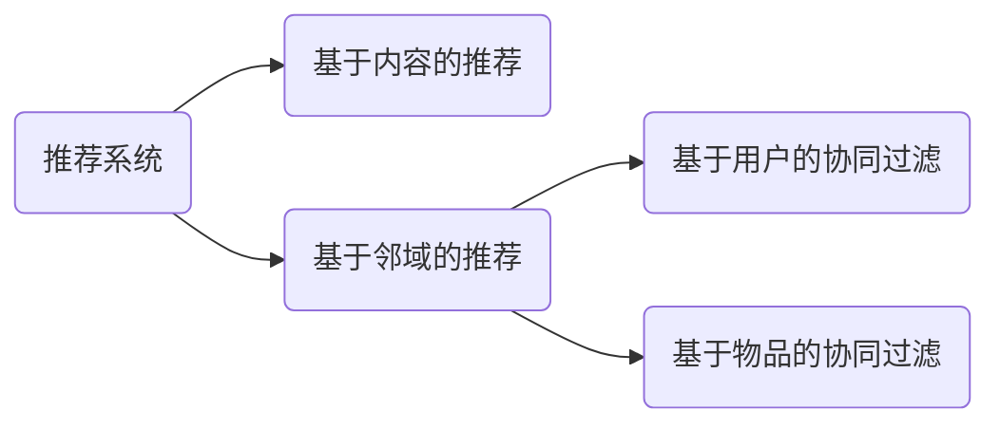


-------------------------------
# 第四章 推荐系统的基础算法笔记（二）

- 基于用户：从用户的兴趣相似出发，给用户推荐**与其兴趣相似的其他用户喜欢的**物品；

- 基于物品：就是直接给用户推荐和**他之前喜欢的物品相似**的物品。

## 4.1 基于内容的推荐算法
基于内容的推荐系统本质是对内容进行分析，建立特征；基于用户对何种特征的内
容感兴趣以及分析一个内容具备什么特征来进行推荐。

内容推荐的基本方法：

- 特征（内容）提取：提取每个待推荐物品的特征（内容属性）
- 用户偏好计算：利用一个用户过去的显式评分或者隐式操作记录，计算用户不同
特征（内容属性）上的偏好分数
- 内容召回：将待推荐物品的特征与用户偏好得分匹配，取出用户最有可能喜欢
的物品池。
- 物品排序：按用户偏好召回物品池，可能一次性挑选出很多内容，这时候我们可
以进一步根据这些电影的平均分进行排序

优点：

 1. 物品没有冷启动问题，因为物品的内容特征不依赖于用户数据；同时推荐出的物
品不会存在过于热门的问题；
  2. 能为具有特殊兴趣爱好的用户进行推荐；
  3. 原理简单，易于定位问题

### 4.1.2 基于内容推荐的特征提取
基于内容进行推荐建立在物品已经有明确的内容特征的基础上。当数据库中并没有内容特征数据时，该如何处理？

真实推荐系统中待推荐的物品往往都会有一些可以描述它的特征。这些特征通常可以分为两种：**结构化的（s tructured ）特征与非结构化的( unstructured ）特征**。所谓**结构化特征就是特征的取值限定在某个区间范围内**，并且可以按照定长的格式来表示。

非结构化的特征往往无法按固定格式表示，最常见的非结构化数据就是文章。例如
对推荐文章，我们往往会把文本上的非结构化特征转化为结构化特征，然后加入到模型中使用。

###### 下面我们就详细介绍如何把非结构化的文字信息结构化：
例如N 个待推荐文章的集合为D = ｛d1，d2，d3，…，dN ｝，而所有文章中出现的词的集合为T = {ti , t2, t3 · · , tm ｝，下面将其称为词典（对于英文文本，可直接取单词；对于中文文章，需要先进行分词，常用的开源分词工具有结巴分词①、中科院分词等）。也就是说，我们有N 篇待推荐的文章，而这些描述里包含了m 个不同的词。我们最终要使用一个向量来表示每一篇文章，比如第1 篇文章表示为dj = ( W1j, W2j ，…，问1 ），其中W1j表示第1 个词tij 在第j 篇文章中的权重，该值越大表示越重要；向中其他向量的解释类似。所以，现在关键就是如何计算dj各分量的值了。有以下几种常见的计算方法：

这时推荐系统取得分score 最高的文章推荐即可。余弦值的范围在［－1,l］之间，值**越趋近于1 ，代表两个向量的方向越接近，用户越可能喜欢；值越趋近于一1 ，它们的方向越相反，则用户越不可能喜欢**。这样，我们就完成了文章这种不具备结构化内容特征的物品的推荐。
## 4.2 基于协同的推荐算法
基于内容的推荐方法用户易于理解，简单有效，但是它的**缺点**也十分明显。

   1. 它要求内容必须能够抽取出有意义的特征，且要求这些特征内容有良好的结构
性
    2. 推荐精度较低，相同内容特征的物品差异性不大。
    
因为以上这些原因，在推荐系统中基于内容的推荐往往会和其他方法混合使用。目
前来说，推荐系统中最常见的算法就是基于邻域的算法。基于邻域的推荐算法可以分为
两大类，一类是基于用户的协同过滤；另一种是基于物品的协同过滤。

### 4.2.1 基于物品的协同算法
**核心思想：给用户推荐那些和他们之前喜欢的物品相似的物品**

基于物品的协同算法首先计算物品之间的相似度，计算相似度的方法有以下几种。
- 基于共同喜欢物品的用户列表计算
- 基于余弦
- 热门物品的惩罚

### 4.2.2 基于用户的协同算法
基于用户的协同过滤（User CF ）的原理其实是和基于物品的协同过滤类似的。所不
同的是，基于物品的协同过滤的原理是用户U 购买了A 物品，推荐给用户U 和A 相似
的物品B 、C 、D 。而基于用户的协同过滤，是先计算用户U 与其他的用户的相似度，然后取和U 最相似的几个用户，把他们购买过的物品推荐给用户U。在当当网的页面上，同样有类似的应用。

### 4.2.3 基于用户协同和基于物品协同的区别
 1. 从推荐的场景考虑：Item CF 是利用物品间的相似性来推荐的，所以假如用户的数量远远超过物品的数量，那么可以考虑使用Item CF ，UserCF 是推荐用户所在兴趣小组中的热点，更注重社会化，而Item CF 则是根据用户历史行为推荐相似物品，更注重个性化。所以UserCF 一般用在新闻类网站中，如Digg,而ItemCF 则用在其他非新闻类网站中，如Amazon 、hulu 等
 2. 在系统的多样性（也被称为覆盖率，指一个推荐系统能否给用户提供多种选择〉
指标下，ItemCF 的多样性要远远好于UserCF ，因为UserCF 会更倾向于推荐热门的物
品。也就是说，ItemCF 的推荐有很好的新颖性，容易发现并推荐长尾里的物品。所以大多数情况，ItemCF 的精度稍微小于UserCF ，但是如果考虑多样性，UserCF 却比ItemCF要好很多。由于UserCF 经常推荐热门物品，所以它在推荐长尾里的项目方面的能力不足；而Item CF 只推荐A 领域给用户，这样它有限的推荐列表中就可能包含了一定数量的非热门的长尾物品。ItemCF 的推荐对单个用户而言，显然多样性不足，但是对整个系统而言，因为不同的用户的主要兴趣点不同，所以系统的覆盖率会比较好
 3. 用户特点对推荐算法影响的比较

### 基于矩阵分解的推荐方法

那么如果A 不是方阵，即行和列数目不相同时，我们还可以对矩阵进行分解吗？答
案是可以。其中最常用的分解方法是奇异值分解（**Singular Value Decomposition, SVD ）**

